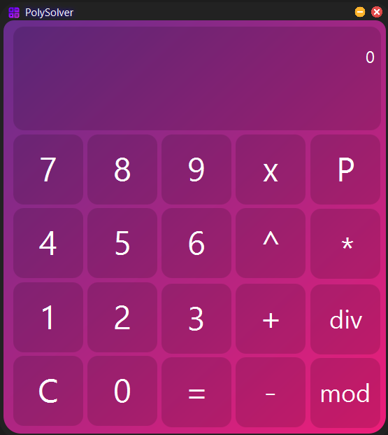
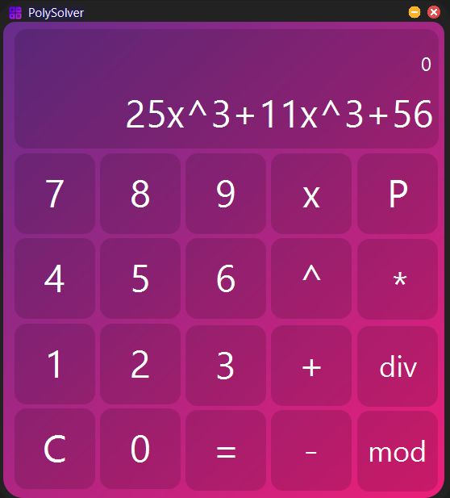
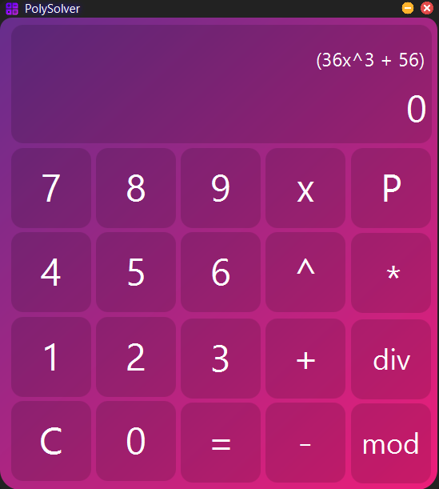
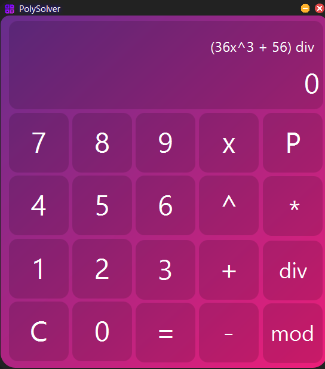
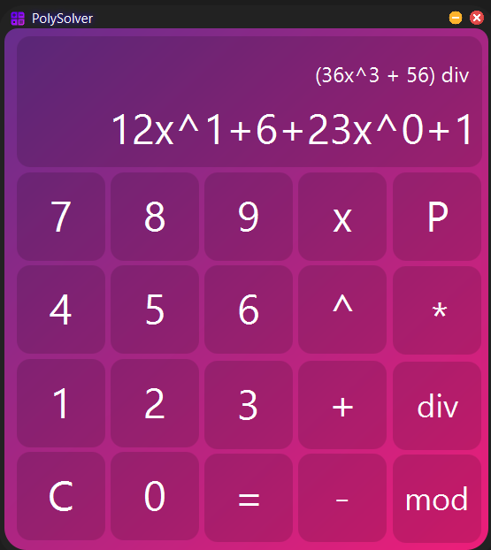
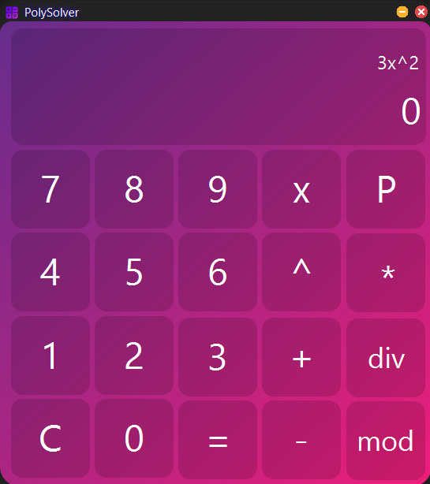

# Polynomial Calculator

_The Polynomial Calculator is a powerful tool designed for performing polynomial arithmetic. It
supports the following operations:_

- ***Addition*** _: Combine two polynomials by summing up their corresponding terms._
- ***Subtraction*** _: Subtract one polynomial from another by adjusting the coefficients of corresponding terms._
- ***Multiplication*** _: Multiply two polynomials to produce a new polynomial with degrees and coefficients derived
  from the product of terms._
- ***Division*** _: Divide one polynomial by another, providing the option to view:_
    - ***Quotient (div)*** _: The result of the division without the remainder._
    - ***Remainder (mod)*** _: The leftover part when one polynomial is divided by another._



## Functionalities

### Polynomial Form

Each element of a polynomial (a monomial) must be written in the format: number x ^ power.
Example: ``` 3x^2, -5x^3, 2x^0 ```.

To construct a polynomial, enter multiple monomials separated by + or -.
Example: ``` 3x^2+5x^1-2x^0 ```.

After saving the polynomial to memory, the calculator will automatically combine monomials with the same degree,
simplifying the expression.

### Special Characters

- ```P```: Saves the entered polynomial to memory as the first operand for calculations.
- ```C```: Clears the entered polynomial.
- ```div```: Displays the quotient of the polynomial division.
- ```mod```: Displays the remainder of the polynomial division.
- ```=```: Executes the selected operation between the saved polynomial (first operand) and the current polynomial
  (second operand).

### Operation Selection

To perform a calculation

1. Enter the first operand of the calculation.
    - _Example: ```12x^3+11x^2+5x^1```._

   

2. Press the symbol ```P```, so that the polynomial can be saved into memory as the first operand.
    - The input field is cleared
    - _Example: The polynomial will be shown under the form ```(36x^3 + 56)```._

   

3. Introduced the desired operation between ```+```, ```-```, ```div```, ```mod``` and press ```P```
    - The operation will be selected
    - _Example: ```div``` was selected and the output will be: ```(36x^3 + 56) div```_

   

4. Enter the second operand of the calculation.
    - _Example: ```12x^1+6+23x^0+1```._

   

5. Press on ```=```.
    - _Example: It will output the quotient between the two polynomials ```3x^2```._

   

### Handling Long Polynomials

If the entered polynomial exceeds 15 characters, the calculator will temporarily save the first 15 characters and clear
the input field, allowing the user to continue entering additional characters. Once all parts of the polynomial have
been entered, pressing the ```P``` symbol will combine all the entered characters and save the complete polynomial into
memory. This ensures that users can work with polynomials of any length seamlessly.